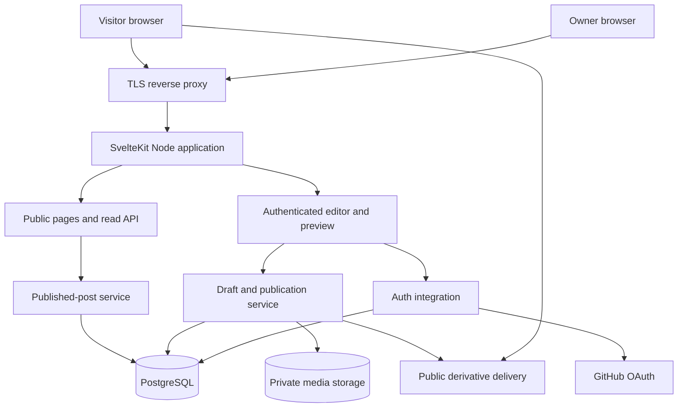
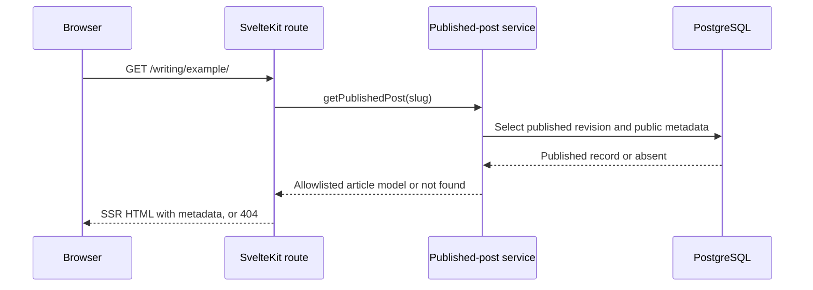
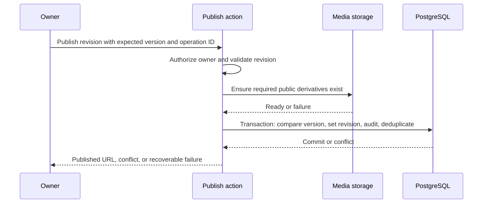

# System design

## Architecture

Proposed scale: one author, a small article archive, modest read traffic. Use one SvelteKit deployment with modular internals. No Redis, message broker, microservices, or search cluster initially.

Browser input is untrusted. The app owns validation and authorization. Database and object-store credentials are private server configuration. GitHub identity proves login; the application allowlist determines editor permission. Public visitors never connect to PostgreSQL or receive private media credentials.

## Published read

API routes, RSS, sitemap, and page loads all call the same published-read service. The service may memoize sanitized rendering by immutable revision ID with a bounded memory cache, but each request still verifies the current published pointer. A render cache must not bypass unpublication checks.

## Publication transaction

Database transactions do not cover object storage. Media promotion is idempotent and precedes the transaction; failed commits can leave unreferenced objects, handled by reconciliation. Do not claim publication succeeded until the database commit succeeds. A duplicate operation ID returns the original outcome.

## Rendering and cache policy

Initial policy favors straightforward correctness. SSR homepage, article/archive, public API, feeds, and sitemap return `Cache-Control: no-store`; immutable static assets and published image derivatives can use long cache lifetimes. Verify the proxy honors this, including framework data requests. Authenticated and preview responses use `private, no-store`.

This means a database check for each dynamic request, but ensures new posts and unpublishing are visible without rebuilds or distributed invalidation. Add shared HTML/data caching only after measuring load and designing purge behavior for publication, unpublication, slug changes, feeds, and SvelteKit navigation data together.

The homepage can render its static portfolio sections when the writing query fails, showing “Writing is temporarily unavailable.” Article and API failures return 503 with a useful retry path; absence after a successful query returns 404. An empty result is not a storage failure.

## Deployment topology

- Local: application process, local PostgreSQL, isolated media storage or storage emulator, development auth configuration.
- Staging: same runtime shape, separate database/bucket/auth callback, no indexing, representative non-sensitive content.
- Production: Node-capable host, managed PostgreSQL in the same region, object storage, TLS proxy, environment secrets, and health monitoring.

Hosting vendor and paid plan remain open; no accounts or resources are created by this plan. Compare supported Node versions, connection limits, backup/export capabilities, regions, sleep behavior, and recurring cost at selection time.

CI should install with the frozen pnpm lockfile, check types/lint/tests, build, exercise integration tests against disposable PostgreSQL, and run browser tests against the production build. Only then package the deployable artifact. Apply reviewed migrations through one serialized release job; avoid every replica racing migrations at startup.

Health endpoints: liveness reports process health without sensitive details; readiness checks a lightweight database query with a timeout and reports unavailable until the runtime can serve dynamic requests. Image-storage failures should block uploads rather than mark otherwise usable published pages unavailable.

## Reliability, security, and operations

| Concern | Initial design / verification |
| --- | --- |
| Database timeout | Bounded query timeout and request budget; no unbounded automatic retry of writes |
| Concurrent editing | Version comparison and operation deduplication; keep unsaved text on conflict |
| Draft leakage | Published pointer invariant, explicit DTOs, authenticated previews/media, no public cache |
| Malicious content | Validate inputs, sanitize final HTML, safe URL schemes, output-context escaping, CSP tested with SvelteKit |
| Resource exhaustion | Bound body/upload sizes, image decoding, pagination, and request rates; configure limits at proxy and app |
| Auth outage | Public reads continue; owner receives login failure; no emergency anonymous editing mode |
| Broken media | Reserved geometry and accessible fallback; log asset failures without exposing private keys |
| Slug change | Reserve old slug and redirect to the current published canonical URL; old slug of unpublished post returns 404 |
| Failed release | Previous compatible artifact available; additive schema changes first |
| Backup | Daily database backup plus private/public media backup or versioning; target RPO ≤24h and RTO ≤4h, pending a tested provider configuration |

Record request ID, route template, duration, response status, and stable error code. Do not log raw post bodies, cookies, tokens, OAuth codes, or full sensitive URLs. Monitor server errors, readiness, storage failures, and failed publications; start with short retention, proposed 14 days for runtime logs and 90 days for admin audit events, revisiting actual needs.

Restore rehearsal: restore database and media into isolated staging, verify revision references and asset keys, open representative posts, test owner login recovery, and compare post counts before accepting backup readiness. Backups alone are not evidence of recoverability.

## Expansion triggers

- Several concurrent authors or a rich editorial workflow: compare managed/headless CMS before extending the custom editor.
- Measured read bottleneck: optimize queries and connection pooling, then consider shared cache with explicit withdrawal behavior.
- Slow image transformations: move processing to a bounded background worker with durable job state.
- Large archive with demonstrated retrieval needs: begin with PostgreSQL search; external search requires evidence.
- External consumers needing write access: design a scoped authenticated API separately from browser session actions.
